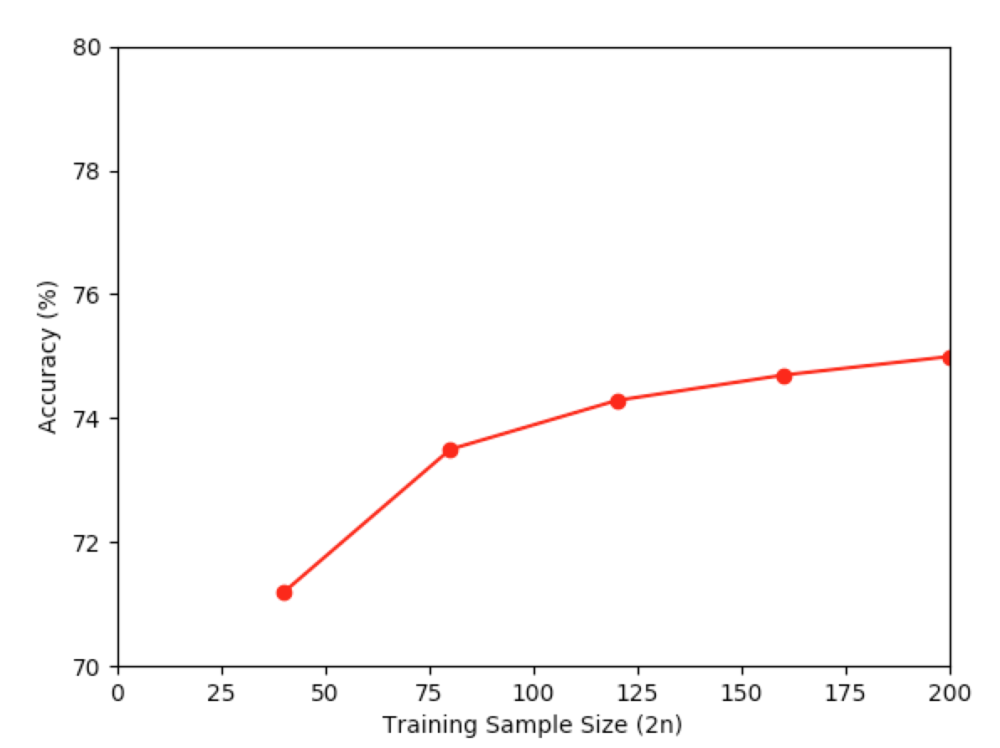

# Linear Regression

- Randomly select n (Let n=20, 40, 60, 80, 100) data from 2 different group as the training set with remaining data as the test set.
- Run 1000 independent experiments, and calculate the prediction accuracy.
- Plot the accuracy rate vs n.
- Tweak the arguments in Makefile for different results.



(Note: `pipenv` doesn't work with `matplotlib` 😕)

## Get started

> First time

```bash
make all
```

> After first time

```bash
make start
```


# Dependency:

- Python 3+
- numpy
- matplotlib
- xlrd
